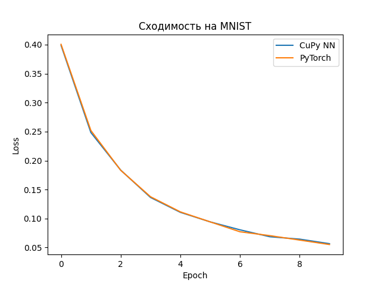

## О библиотеке

Простая нейросетевая библиотека на CuPy для создания и обучения CNN, Dense и других моделей. Основная цель — возможность
экспериментов с кастомными слоями и обучение.

## Сравнение с PyTorch

Я протестировал простую CNN на MNIST (10 эпох).

**Результаты:**

- Использовано VRAM (GPU):
    - CuPy NN: **0.55 GB**
    - PyTorch: **3.21 GB**
- Время обучения (10 эпох):
    - CuPy NN: **15.60 s**
    - PyTorch: **9.65 s**
- Forward + Backward (1 sample):
    - CuPy NN: forward **0.00222 s**, backward **0.01688 s**
    - PyTorch: forward **0.00411 s**, backward **0.00903 s**

График сходимости (`loss` по эпохам):



Вывод:

- Обе реализации показывают **одинаковую тенденцию сходимости**.
- PyTorch ожидаемо быстрее на backward, за счёт высоко оптимизированных CUDA-ядер.
- Кастомная реализация экономит VRAM, что делает ее более масштабируемой, где разница в скорости стремится к нулю.

---

## Особенности реализации

1. **Conv2D → Dense и PyTorch:**  
   При полной проверке `conv2d -> dense` с фиксированными весами возможны расхождения из-за разного формата данных:
    - В этой библиотеке: `(B, H, W, C)`
    - В PyTorch: `(B, C, H, W)`  
      Это **не влияет на сходимость**, а при корректном `reshape` обе реализации совпадают.

2. **Ускорение через flatten в conv2d:** при умножении патчей на kernels используется `flatten (B*H*W, kh*kW*C)` →
   матричные умножения
   работают быстрее. Так же веса в conv2d хранятся в транспонированном виде.

3. **Train vs Inference:**
    - `train=True` → сохраняются матрицы для backprop.
    - `train=False` → они не сохраняются (экономия VRAM).  
      ⚠️ Поэтому после `forward(train=False)` нельзя вызывать `backward`.

4. **MultiConvAttention:**  
   Является чисто экспериментом.
5. **Schedulers:**  
   Оптимизаторы поддерживают расписания обучения (`InverseSqrtScheduler`, модификации и др.).
6. **Автоматическая инициализация:**  
   Основной класс `NeuralNetwork` сам подбирает корректные входные параметры для слоёв (в большинстве случаев), поэтому
   нет нужды на каждом слою прописывать `input_dim`, кроме первого.

---

## Доступно

1. Слои: Conv2d, Dense, SelfAttention, ConvAttention, MultiAttentionWo, MultiHead, MultiConvAttention.
2. Активации: Relu, Sigmoid, Softmax, LeakyRelu, ELU, Tanh.
3. Функции потерь: MSE, MAE, CCE, CCE_Logits, BCE, BCE_Logits.
4. Оптимизаторы: Adam, SGD.
5. Нормализаторы: BatchNorm, LayerNorm.
6. Schedulers: InverseSqrtScheduler, InverseSqrtSchedulerMod1, InverseSqrtSchedulerMod2.
7. Инициализации: xavier_uniform, kaiming_uniform.
8. Загрузчики: DataLoader, AsyncCupyDataLoader.
9. Другие возможности: Pooling, Patching, Padding, Dropout.

---
При установке cupy и torch обязательно использовать версии совместимые с cuda.
Например:

```bash
pip install cupy-cuda12x
```` 

```bash
pip install torch torchvision --index-url https://download.pytorch.org/whl/cu126
````

Установить зависимости для использования библиотеки:

```bash
pip install -r requirements.txt
```

Установить зависимости для использования библиотеки + сравнения с torch:

```bash
pip install -r requirements-dev.txt
```

Примеры создания сетей можно посмотреть в `examples\example_nets.py`
Пример создания и использования в `examples\compare_pytorch.py`