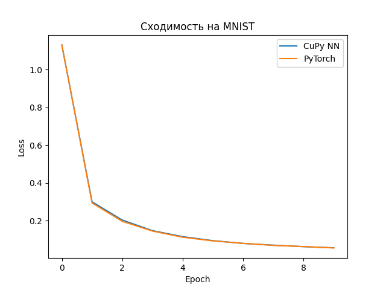

## О библиотеке

Простая нейросетевая библиотека на CuPy для создания и обучения CNN, Dense и других моделей. Основная цель — возможность
экспериментов с кастомными слоями и обучением.

Библиотека не использует autograd — обратное распространение реализовано вручную для каждого слоя.
Фокус — на читаемости, понятных правилах хранения промежуточных тензоров, и возможности вмешаться в процесс обучения.

Изначально проект начинался как набор «ручных» реализаций слоёв (Conv2D, Attention, Dense и т.д.) для лучшего понимания того, как они работают внутри.
Со временем этот набор вырос до полноценной мини-библиотеки, где можно:

- экспериментировать с кастомными слоями,

- менять устройство backpropagation,

- изучать работу CNN/Attention «на уровне матриц»,

- тестировать собственные архитектуры без магии автоградов.

Цель проекта — дать понятный, прозрачный и полностью контролируемый инструментарий, напоминающий PyTorch по духу, но гораздо проще и ближе к низкоуровневой логике.

Хотя библиотека изначально создавалась как учебно-экспериментальная, она уже была протестирована в реальном проекте: [ссылка на репозиторий](https://github.com/Delisseu/Stack)  

Библиотека подходит тем, кто хочет разобраться «как это работает внутри», а не просто использовать готовые блоки.

## Сравнение с PyTorch

Я протестировал простую CNN на MNIST (10 эпох).

**Результаты:**

- Использовано VRAM (GPU):
    - CuPy NN: **0.59 GB**
    - PyTorch: **0.23 GB**
- Время обучения (10 эпох):
    - CuPy NN: **13.5 s**
    - PyTorch: **8.8 s**
- Forward + Backward (1 sample):
    - CuPy NN: forward **0.00222 s**, backward **0.01688 s**
    - PyTorch: forward **0.00411 s**, backward **0.00903 s**

График сходимости (`loss` по эпохам):



Вывод:

- Обе реализации показывают **одинаковую тенденцию сходимости**.
- PyTorch ожидаемо быстрее на backward, за счёт высоко оптимизированных CUDA-ядер.
- Потери VRAM связаны с тем, что библиотека сохраняет больше временных матриц для backprop, поскольку не использует оптимизации cudnn/cutlass.
---

## Особенности реализации

1. **Conv2D → Dense и PyTorch:**  
   При полной проверке `conv2d -> dense` с фиксированными весами возможны расхождения из-за разного формата данных:
    - В этой библиотеке: `(B, H, W, C)`
    - В PyTorch: `(B, C, H, W)`  
      Это **не влияет на сходимость**, а при корректном `reshape` обе реализации совпадают.

2. **Ускорение через flatten в conv2d:** при умножении патчей на kernels используется `flatten (B*H*W, kh*kW*C)` →
   матричные умножения работают быстрее. Веса в conv2d хранятся в транспонированном виде.

3. **Train vs Inference:**
    - `train=True` → сохраняются матрицы для backprop.
    - `train=False` → они не сохраняются (экономия VRAM).  
      ⚠️ Поэтому после `forward(train=False)` нельзя вызывать `backward`.

4. **MultiConvAttention:**  
   Является экспериментальным слоем.
5. **Schedulers:**  
   Оптимизаторы поддерживают расписания обучения (`InverseSqrtScheduler`, модификации и пр.).
6. **Автоматическая инициализация:**  
   Основной класс `NeuralNetwork` сам подбирает корректные входные параметры для слоёв (в большинстве случаев), поэтому
   нет нужды на каждом слою прописывать `input_dim`, кроме самого первого.

---

## Доступно

1. Слои: Conv2d, Dense, SelfAttention, ConvAttention, MultiAttentionWo, MultiHead, MultiConvAttention.
2. Активации: Relu, Sigmoid, Softmax, LeakyRelu, ELU, Tanh.
3. Функции потерь: MSE, MAE, CCE, CCE_Logits, BCE, BCE_Logits.
4. Оптимизаторы: Adam, SGD.
5. Нормализаторы: BatchNorm, LayerNorm.
6. Schedulers: InverseSqrtScheduler, InverseSqrtSchedulerMod1, InverseSqrtSchedulerMod2.
7. Инициализации: Xavier_uniform, Kaiming_uniform.
8. Загрузчики: DataLoader, AsyncCupyDataLoader.
9. Другие возможности: Pooling, PatchExtractor, Padding, Dropout, Aggregation.

---

## Требования

- Python 3.9+  
- При установке cupy и torch обязательно использовать версии совместимые с cuda. Например:

    ```bash
    pip install cupy-cuda12x
    ```` 
    
    ```bash
    pip install torch torchvision --index-url https://download.pytorch.org/whl/cu126
    ````


- Установить зависимости для использования библиотеки:
    ```bash
    pip install -r requirements.txt
    ```

- Установить зависимости для использования библиотеки + сравнения с torch:
    ```bash
    pip install -r requirements-dev.txt
    ```

Примеры создания сетей можно посмотреть в `examples/example_nets.py`
Пример создания и использования в `examples/compare_pytorch.py`
